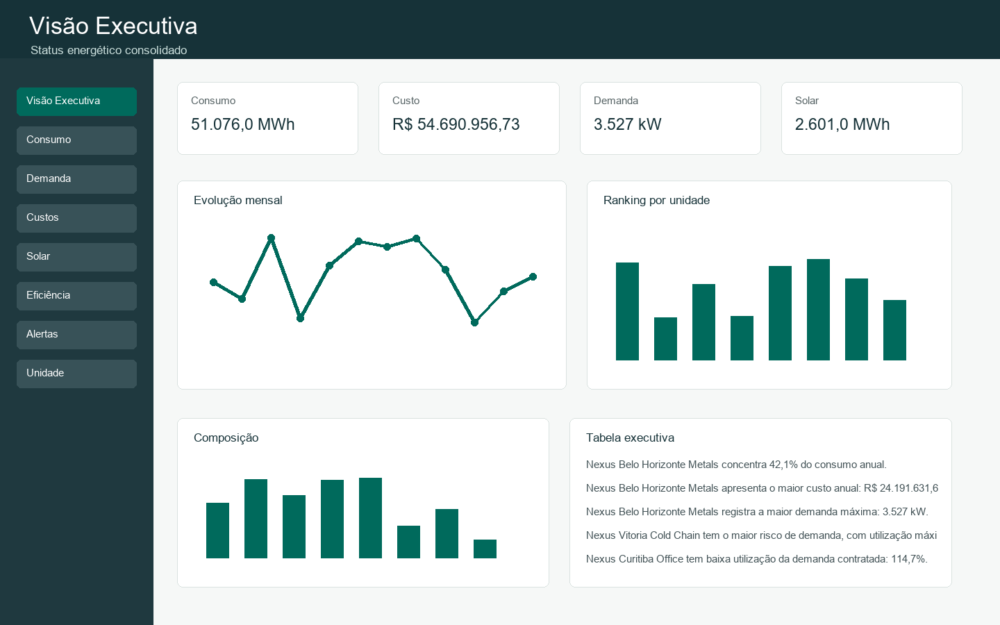
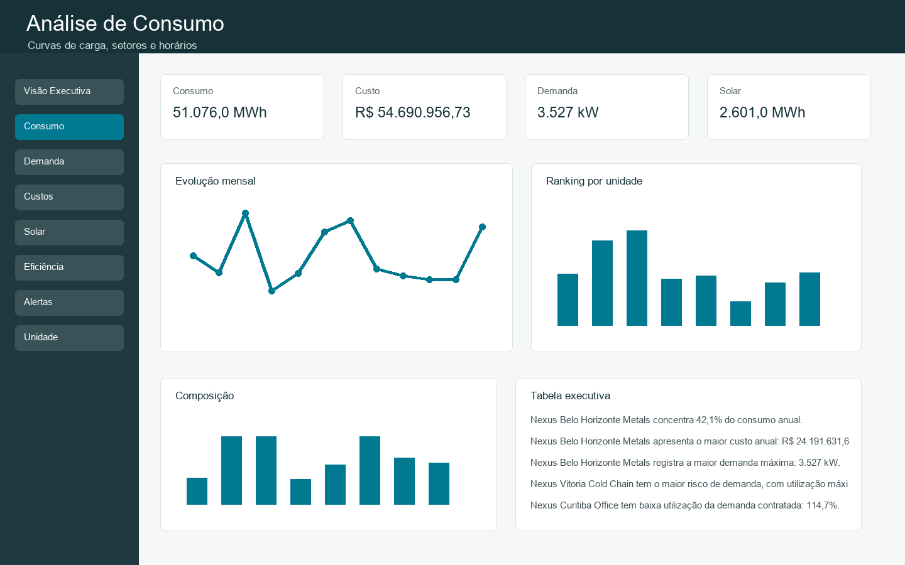
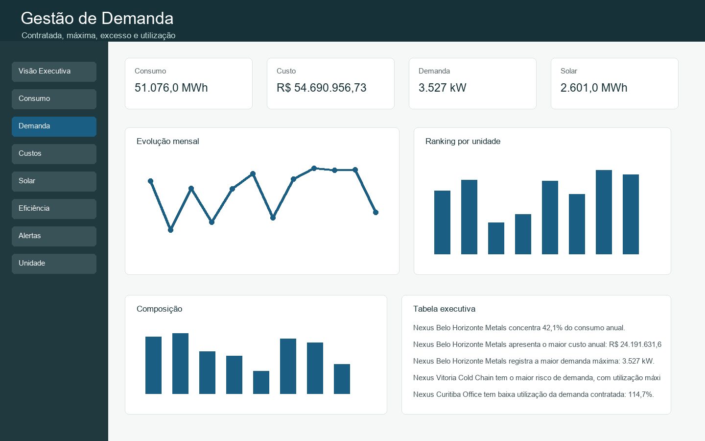
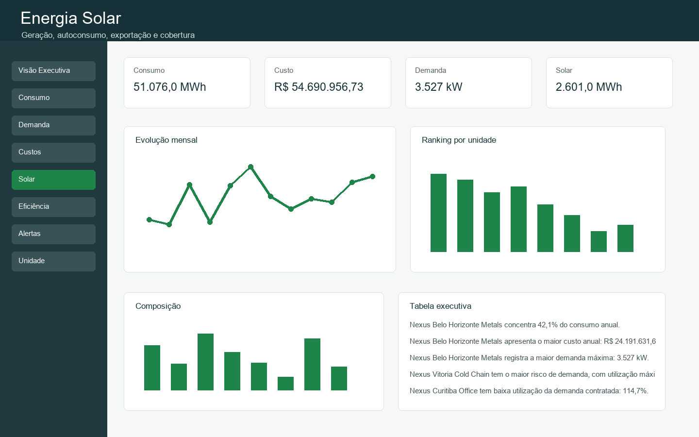
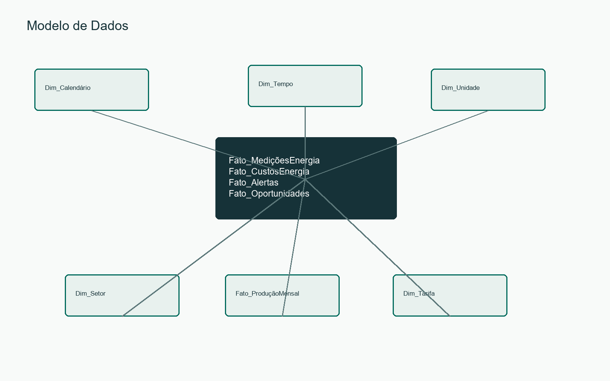
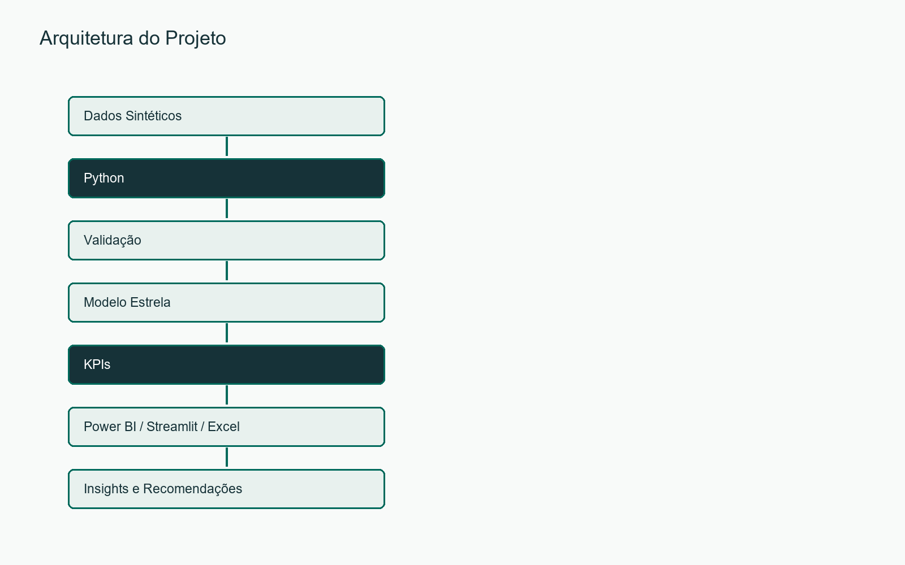

# Dashboard de Gestão e Analytics de Energia

Engenharia Elétrica • Gestão de Energia • Power BI • Python • Eficiência Energética



## Visão Geral
Plataforma analítica de portfólio para gestão energética de uma empresa fictícia, a Nexus Industrial Group. O projeto usa dados sintéticos horários para analisar consumo, demanda, custos, geração fotovoltaica, emissões, baseline, alertas e oportunidades de eficiência energética.

## Problema
Operações industriais e comerciais precisam transformar medições de energia em diagnósticos claros: quando a empresa consome, onde estão os picos, quanto custa operar, qual unidade é menos eficiente e quais ações geram retorno.

## Objetivo
Demonstrar aplicação prática de Engenharia Elétrica, Gestão de Energia, Data Analytics, Power BI e Python em um case profissional pronto para GitHub, LinkedIn, currículo e entrevistas.

## Demonstração
Execute `INICIAR_DASHBOARD.bat` ou rode `streamlit run app.py`. A versão web local possui oito páginas: Visão Executiva, Análise de Consumo, Gestão de Demanda, Custos e Tarifas, Energia Solar, Eficiência Energética, Alertas e Anomalias e Detalhamento da Unidade.





## Cenário de Estudo
A Nexus Industrial Group possui 6 unidades fictícias com perfis distintos: fábricas, logística, escritório, operação contínua e cadeia fria. Todos os dados são sintéticos e não representam clientes, faturas, contratos ou tarifas reais.

## Base de Dados
- Período: 01/01/2025 a 31/12/2025
- Granularidade: horária
- Registros horários: 315.360
- Registros mensais de custo: 72
- Unidades: 6
- Setores: 10

## Principais Indicadores
- Consumo total: 51.076,0 MWh
- Custo total: R$ 54.690.956,73
- Demanda máxima: 3.527 kW
- Custo médio: R$ 1,07/kWh
- Geração solar: 2.601,0 MWh
- Cobertura solar: 5,1%
- Dependência da rede: 94,9%
- Emissões evitadas: 99,9 tCO2e
- Economia potencial: R$ 7.075.714,72/ano

## Análise de Consumo
A aplicação apresenta curva média diária, curva por dia útil e fim de semana, consumo por hora, setor, unidade e heatmap Dia da Semana x Hora com ordem operacional correta.

## Gestão de Demanda
A análise compara demanda máxima, demanda contratada, excesso, utilização e custo de ultrapassagem. A metodologia de excesso é `MAX(Demanda Máxima - Demanda Contratada, 0)`.

## Análise de Custos
Os custos são calculados com tarifa sintética parametrizável: energia em ponta/fora ponta, demanda, ultrapassagem, impostos e encargos. Nenhuma tarifa é apresentada como oficial.

## Energia Solar
A geração fotovoltaica é modelada somente em horas diurnas. A cobertura solar é `Autoconsumo Solar / Consumo` e o autoconsumo percentual é `Autoconsumo Solar / Geração Solar`.

## Eficiência Energética
O projeto inclui baseline por unidade, setor, dia da semana e hora, desvio absoluto/percentual, intensidade energética, oportunidades, investimento, economia anual e payback simples.

## Alertas e Anomalias
A detecção estatística usa z-score, média móvel e IQR. Ela não é apresentada como IA. O total atual é 562 anomalias detectadas e 36 alertas operacionais.

## Modelo de Dados


Modelo estrela com fatos de medições, custos, oportunidades, alertas e produção mensal conectados às dimensões de calendário, tempo, unidade, setor e tarifa.

## Tecnologias Utilizadas
Python, pandas, NumPy, Streamlit, Plotly, Power BI, DAX, Power Query, Excel, pytest e Pillow.

## Power BI
O pacote Power BI está documentado em `powerbi/`. Inclui tema, medidas DAX, Power Query, modelo de dados e especificação de oito páginas. Não há PBIX falso.

## Dashboard Web
O arquivo `app.py` entrega a versão demonstrativa em Streamlit com filtros globais reais e KPIs recalculados conforme unidade, período, setor, tipo de unidade, dia útil e horário de ponta.

## Excel
`Energy_Management_Data.xlsx` contém resumo executivo, KPIs, custos mensais, unidades, tarifas, oportunidades, alertas e produção mensal, com formatação profissional.

## Arquitetura


## Insights
Os principais insights calculados estão em `docs/insights.md` e em `resumo_portfolio.json`.

## Estrutura do Repositório
Dados ficam em `data/`, scripts em `scripts/`, testes em `tests/`, documentação Power BI em `powerbi/`, documentação executiva em `docs/`, materiais de LinkedIn em `linkedin/` e imagens em `assets/`.

## Como Executar
```bash
pip install -r requirements.txt
python scripts/finalizar_projeto.py
streamlit run app.py
```

## Como Atualizar os Dados
Execute `ATUALIZAR_TUDO.bat`. O script valida dados, recalcula KPIs, atualiza `resumo_portfolio.json`, executa testes e gera relatório de validação.

## Testes e Validação
A suíte valida balanço energético, solar noturno, demanda, custos, emissões, fator de carga, cobertura solar, autoconsumo, dependência da rede, baseline, intensidade energética, anomalias, nulos, IDs e duplicidades.

## Privacidade
Todos os dados são sintéticos. O projeto não contém faturas reais, contratos reais, unidades consumidoras reais ou dados confidenciais.

## Limitações
Tarifas, emissões e perfis operacionais são premissas demonstrativas. O projeto não substitui auditoria energética, estudo tarifário regulatório, projeto elétrico ou validação metrológica.

## Evoluções Futuras
Dados de 15 minutos, IoT, medidores inteligentes, previsão de demanda, previsão de consumo, previsão solar, BESS, Demand Response, tarifas reais, mercado livre de energia e digital twin energético.

## Autor
Lucas
